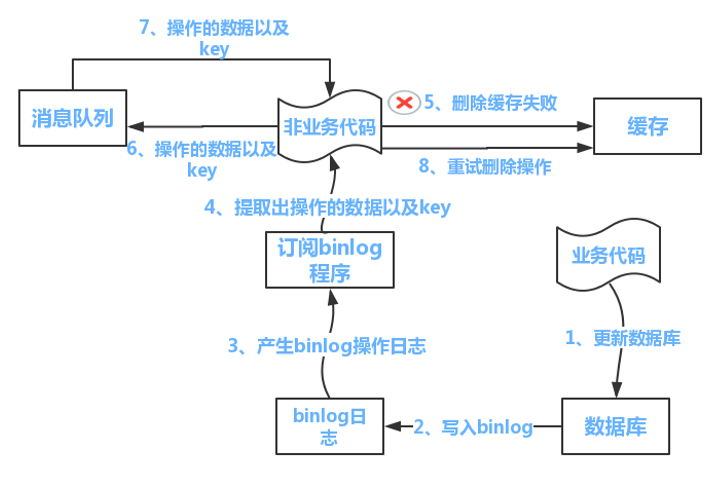

## Redis 怎么保证缓存一致性？

当需要更新数据时，无论是先写到Redis里再写到MySQL，还是先写MySQL再写Redis，这两步写操作不能保证原子性，所以会出现Redis和MySQL里的数据不一致。因为写和读是并发的，没法保证顺序，如果对Redis里的数据**设置过期时间**就能够保证最终一致性，对架构做的优化只能降低不一致性发生的概率，不能从根本上避免不一致性。

● 先更新数据库，再更新缓存（×）：假设有线程A先更新数据库，线程B后更新缓存，然后由于网络原因，线程B先更新了缓存，最后线程A再更新缓存，这时候会出现数据库和缓存不一致的情况。

● 先更新缓存，在更新数据库（×）：因为以数据库的数据为准，所以先更新数据库。

● 先删除缓存，再更新数据库：如果删除了缓存Redis，还没有来得及写进MySQL数据库，另一个线程就来读取，发现缓存为空，则去数据库中读取数据写入缓存，此时缓存中为脏数据。怎么保证缓存一致性？

**解决办法**

* **延迟双删**

1）先删除缓存 2）再写数据库3）休眠500毫秒4）再次删除缓存。**那么，这个500毫秒怎么确定的，具体该休眠多久呢？**需要评估自己的项目的读数据业务逻辑的耗时。这么做的目的，就是确保读请求结束，写请求可以删除读请求造成的缓存脏数据。当然这种策略还要考虑redis和数据库主从同步的耗时。最后的的写数据的休眠时间：则在读数据业务逻辑的耗时基础上，加几百ms即可。比如：休眠1秒。

2）**设置缓存过期时间：**从理论上来说，给缓存设置过期时间，是保证最终一致性的解决方案。所有的写操作以数据库为准，只要到达缓存过期时间，则后面的读请求自然会从数据库中读取新值然后回填缓存。

**该方案的弊端：**结合双删策略+缓存超时设置，这样最差的情况就是在超时时间内数据存在不一致，而且又增加了写请求的耗时。

上面的方法在高并发情况下，休眠500毫秒太多了，并且吞吐量降低了，所以可以采取异步删除的策略，另起一个线程。**如果第二次删除缓存失败怎么办？**会再次出现缓存和数据库不一致的问题。

**延迟双删中的删为什么不是更新缓存，而是删除缓存？**

举个栗子：一个缓存涉及的表的字段，在 1 分钟内就修改了 20 次，或者是 100 次，那么缓存更新 20 次、100 次；但是这个缓存在 1 分钟内只被读取了 1 次，有大量的冷数据。

实际上，如果你只是删除缓存的话，那么在 1 分钟内，这个缓存不过就重新计算一次而已，开销大幅度降低。用到缓存才去算缓存。

* ##### 异步更新缓存（基于订阅binlog的同步机制，分为7个步骤）

1.**读Redis**：热数据基本都在Redis

2.**写MySQL**: 增删改都是操作MySQL

3.**更新Redis数据**：一旦MySQL中产生了新的写入、更新、删除等操作，就可以把binlog相关的消息推送至Redis，Redis再根据binlog中的记录，对Redis进行更新。

该方法主要强调的是读和写分开，读就redis专业读，写就mysql写然后同步，又读又写很容易有数据不一致。注意：除了binlog，常用的队列还可以使用**Redis**，Kafka，AMQ，RMQ，阿里的canal**。

● 先更新数据库，再删除缓存：如果这时候（1）缓存刚好失效，（2）线程A进行查询得到旧值，（3）线程B更新数据库，（4）删除缓存，（5）线程A写入缓存，则也会出现数据不一致情况。

然而，发生这种情况的概率又有多少呢？
 发生上述情况有一个先天性条件，就是步骤（3）的写数据库操作比步骤（2）的读数据库操作耗时更短，才有可能使得步骤（4）先于步骤（5）。可是，大家想想，数据库的读操作的速度远快于写操作的（不然做读写分离干嘛，做读写分离的意义就是因为读操作比较快，耗资源少），因此步骤（3）耗时比步骤（2）更短，这一情形很难出现。

如果有人抬杠，一定要解决怎么办？

可以采用前面提到的延迟双删策略。

还有其他造成不一致的原因么？
 有的，这也是缓存更新策略（先删除缓存，再更新数据库）和缓存更新策略（先更新数据库，再删除缓存）都存在的一个问题，如果删缓存失败了怎么办，那不是会有不一致的情况出现么。比如一个写数据请求，然后写入数据库了，删缓存失败了，这会就出现不一致的情况了。这也是缓存更新策略（先删除缓存，再更新数据库）里留下的最后一个疑问。如何解决？
提供一个保障的**重试机制**即可，这里给出两套方案，在这里只说明其中最好的一套，另一套会对业务代码造成大量的侵入，如下：

流程如下图所示：
 （1）更新数据库数据
 （2）数据库会将操作信息写入binlog日志当中
 （3）订阅binlog的程序提取出所需要的数据以及key
 （4）另起一段非业务代码，获得该信息
 （5）尝试更新、删除缓存操作，发现操作失败
 （6）将这些信息发送至消息队列
 （7）重新从消息队列中获得该数据，重试操作。

**备注说明**：上述的订阅binlog程序在mysql中有现成的中间件叫canal，可以完成订阅binlog日志的功能。另外，重试机制，采用的是消息队列的方式。如果对一致性要求不是很高，直接在程序中另起一个线程，每隔一段时间去重试即可，这些大家可以灵活自由发挥，只是提供一个思路。

## 什么是Redis缓存穿透、缓存击穿、缓存雪崩？

**缓存穿透：**一般是黑客故意去请求缓存中不存在的数据，导致所有的请求都落到数据库上，造成数据库**短时间内承受大量请求**而崩掉。如发起为id为“-1”的数据或id为特别大不存在的数据。 

解决方案：（1）简单暴力的方法：接口层增加校验，如判断id<=0的直接拦截；（2）简单暴力的方法：如果一个查询返回的数据为空（不管是缓存中，还是数据库中不存在该数据），我们仍然把这个空结果进行缓存**，有效时间可以设置短点**，如30秒，最长不超过5分钟（否则有可能在真的有数据的时候影响了业务正常流程）。这样可以防止攻击用户反复用同一个id暴力攻击。要知道正常用户是不会在单秒内发起这么多次请求的，那网关层Nginx本渣我也记得有配置项，可以让运维大大对单个IP每秒访问次数超出阈值的IP都**拉黑**。（3）最常见的则是采用布隆过滤器，将所有可能存在的数据**哈希**到一个足够大的**bitmap**中，一个一定不存在的数据会被这个bitmap拦截掉，从而避免了对数据库的查询压力。

● **缓存击穿：**指大量用户同时访问一条缓存中没有**但数据库中有的数据**（一般是缓存时间到期），而查询数据量巨大，引起数据库压力过大甚至宕机。

解决方案：（1）设置热点数据永远不过期；（2）使用互斥锁，在缓存失效的时候（判断拿出来的值为空），不是立即去load db，而是先使用Redis的SETNX去set一个mutex key，如果能成功设置，再进行load db的操作并回设缓存；否则的话，表示当前以及有其它线程获取了互斥锁并读取数据库回存缓存了，当前线程重新获取缓存即可。

**缓存雪崩：**缓存雪崩是指缓存中数据大批量到过期时间，而查询数据量巨大，引起数据库压力过大甚至宕机。和缓存击穿不同的是，缓存击穿指并发查同一条数据（例如抢购同一件商品），缓存雪崩是不同数据都过期了，很多数据都查不到从而查数据库。

**场景：**

目前电商首页以及热点数据都会去做缓存 ，一般缓存都是定时任务去刷新，或者是查不到之后去更新的，定时任务刷新就有一个问题。

举个简单的例子：如果所有首页的Key失效时间都是12小时，中午12点刷新的，我零点有个秒杀活动大量用户涌入，假设当时每秒 6000 个请求，本来缓存在可以扛住每秒 5000 个请求，但是缓存当时所有的Key都失效了。此时 1 秒 6000 个请求全部落数据库，数据库必然扛不住，它会报一下警，真实情况可能DBA都没反应过来就直接挂了。此时，如果没用什么特别的方案来处理这个故障，DBA 很着急，重启数据库，但是数据库立马又被新的流量给打死了。**这就是我理解的缓存雪崩**。

解决方案：

（1）缓存数据的过期时间随机设置。

setRedis（Key，value，time + Math.random() * 10000）；

（2）如果缓存数据库是分布式部署，将热点数据均匀分布在不同的服务器中。

（3）设置热点数据永远不过期。有更新操作就更新缓存就好了（比如运维更新了首页商品，那你刷下缓存就完事了，不要设置过期时间），电商首页的数据也可以用这个操作，保险。

总结：

一般避免以上情况发生我们从三个时间段去分析下：

● 事前：Redis 高可用，主从+哨兵，Redis cluster，避免全盘崩溃。

● 事中：本地 ehcache 缓存 + **Hystrix** **限流**+**降级**，避免MySQL 被打死。

● 事后：Redis 持久化 RDB+AOF，一旦重启，自动从磁盘上加载数据，快速恢复缓存数据。

## 过期的数据的删除策略了解么？

如果假设你设置了一批 key 只能存活 1 分钟，那么 1 分钟后，Redis 是怎么对这批 key 进行删除的呢？

常用的过期数据的删除策略就两个（重要！自己造缓存轮子的时候需要格外考虑的东西）：

1. **惰性删除** ：只会在取出 key 的时候才对数据进行过期检查。这样对 CPU 最友好，但是可能会造成太多过期 key 没有被删除。
2. **定期删除** ： 每隔一段时间抽取一批 key 执行删除过期 key 操作。并且，Redis 底层会通过限制删除操作执行的时长和频率来减少删除操作对 CPU 时间的影响。

定期删除对内存更加友好，惰性删除对 CPU 更加友好。两者各有千秋，所以 Redis 采用的是 **定期删除+惰性/懒汉式删除** 。

但是，仅仅通过给 key 设置过期时间还是有问题的。因为还是可能存在定期删除和惰性删除漏掉了很多过期 key 的情况。这样就导致大量过期 key 堆积在内存里，然后就 Out of memory 了。

怎么解决这个问题呢？答案就是：**Redis 内存淘汰机制。**

## Redis 内存淘汰机制了解么？

> 相关问题：MySQL 里有 2000w 数据，Redis 中只存 20w 的数据，如何保证 Redis 中的数据都是热点数据?

Redis 提供 6 种数据淘汰策略：

1. **volatile-lru（least recently used）**：从已设置过期时间的数据集（server.db[i].expires）中挑选最近最少使用的数据淘汰
2. **volatile-ttl**：从已设置过期时间的数据集（server.db[i].expires）中挑选将要过期的数据淘汰
3. **volatile-random**：从已设置过期时间的数据集（server.db[i].expires）中任意选择数据淘汰
4. **allkeys-lru（least recently used）**：当内存不足以容纳新写入数据时，在键空间中，移除最近最少使用的 key（这个是最常用的）
5. **allkeys-random**：从数据集（server.db[i].dict）中任意选择数据淘汰
6. **no-eviction**：禁止驱逐数据，也就是说当内存不足以容纳新写入数据时，新写入操作会报错。这个应该没人使用吧！

4.0 版本后增加以下两种：

1. **volatile-lfu（least frequently used）**：从已设置过期时间的数据集（server.db[i].expires）中挑选最不经常使用的数据淘汰
2. **allkeys-lfu（least frequently used）**：当内存不足以容纳新写入数据时，在键空间中，移除最不经常使用的 key